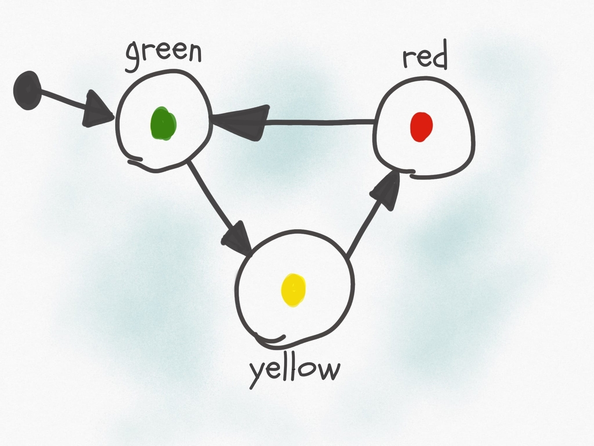
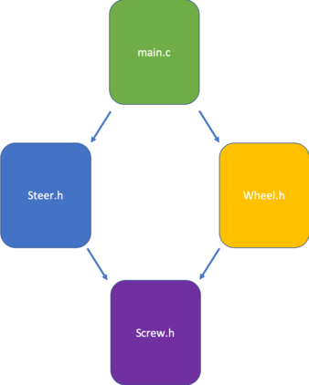

Author: Harrison, Luo (sloab@connect.ust.hk)

# HKUST Robotics Team Software Tutorial 2 - Additional Programming Technique

## **Outline**
* Finite State Machine
* Library

## **Finite State Machine(FSM)**
Finite state machine (FSM) is a term used by programmers, mathematicians, engineers, and other professionals to describe a mathematical model for any system that has a limited number of conditional states of being. It is often a very compact way to represent a set of complex rules and conditions and to process various inputs. For example, traffic light is a common FSM, At any point in time, a traffic light has a defined state. Typically, it either:

1. The green light on, and the other 2 lights off
2. The yellow light on, and the other 2 lights off
3. The red light on, and the other 2 lights off


Each of those 3 scenarios is called state. The traffic light will change state when it receives an input, typically just a fixed timer that decides how much time the traffic lights should be green, yellow, and red.

### Why FSM?
You'll see state machines in embedded devices that have limited memory. Implemented well, a state machine is self-documenting because each logical state represents a physical condition. A state machine can be embodied in a tiny amount of code in comparison to its procedural equivalent and runs extremely efficiently. Moreover, the rules that govern state changes can often be stored as data in a table, providing a compact representation that can be easily maintained.

### How we use FSM in coding?
The coding technique for FSM in C are mainly Enum, Typedef, and Switch. Let's learn this by imagine we are having Pizza for dinner tonight. Firstly, we define the states that the situation might be.

```c
typedef enum {          // Define the states in the state machine.
    NO_PIZZA,           // Exit state machine.
    COUNT_PEOPLE,       // Check how many people are in the room tonight.
    COUNT_SLICES,       // Do you want to have 12 slices or 16 slices?
    ORDERING_PIZZA,     // Order on food ordering and delivery apps.
    WAITING_FOR_DELIVERY // You know there will be a long waiting...
    EAT_PIZZA           // Let's eat!
} PIZZA_STATE;
```

Alright! Now we know all the states, so let's finish the logical process state by state.

```c
int main(){
    PIZZA_STATE state = COUNT_PEOPLE;
    int nPeople, nSlices, nSlicesPerPerson;
    
    while (state != NO_PIZZA)  {
        switch (state)  {
        case COUNT_PEOPLE:  
            if (CountPeople(&nPeople))  // If input is valid..
                state = COUNT_SLICES;       // .. go to next state..
            break;                          // .. else remain in this state.
        case COUNT_SLICES:  
            if (DecideSlices(&nSlices))
                state = ORDERING_PIZZA;
            break;
        case ORDERING_PIZZA:
            if (nSlices % nPeople != 0){    // Can't divide the pizza evenly.                             
                getMorePizzaOrFriends();   // Do something about it.
                state = COUNT_PEOPLE;      // Start over.
            }
            else{
                nSlicesPerPerson = nSlices/nPeople;
                state = WAITING_FOR_DELIVERY;
            }
            break;
        case WAITING_FOR_DELIVERY:
            if(PizzeArrived())
                state = EAT_PIZZA;
            break;
        case EAT_PIZZA:
            if(FinishAllPizza())
                state = NO_PIZZA;  // Exit the state machine.
            break;
        }
    }
}
```

### Conculsion for FSM
The example above shows how we can use FSM in our coding. By doing so, the steps are organized in a logical way so that we can easily understand the logic. Moreover, that's say if we observe a bug while we are in ORDERING_PIZZA State, we only need to check the code in the Ordering state. Similarly, we can use the same idea in our Robots, probably there will be an Idle state, Initialize state, and Working State. It is extremely helpful as our code for robots definitely more complex than this example. 

---

## **Library**
### What is library?
Simply put, a library is a collection of items that you can call from your program.

### Benefit of library
It obviously has a lot of advantages, not least of which is that you can save much time by reusing work someone else has already done and been more confident that it has fewer bugs (since probably many other people use the libraries too, and you benefit from having them finding and fixing bugs). A library is exactly like an executable, except instead of running directly, the library functions are invoked with parameters from your executable.
(Excerpted from https://medium.com/@meghamohan/all-about-static-libraries-in-c-cea57990c495)

### Make our own library
Let's imagine a scenario in which we are going to write code for our robot car, what does the car compose of? At least we need some wheels, a steer, and screws are a common component for both wheels and steer. 

#### Bad example
```c
struct Screw{
    float length;
    float width;
    float weight;
    int color;
}
struct Steer{
    Screw screws[12];
    int direction;
};
void autoSteering(Steer* steer){
    //auto steering control
}
void OptimizeSteeringControl(Steer* steer){
    //optimized steer control
}
struct Wheel{
    Screw screws[10];
    bool clockwise;
    int speed;
};
void MoveForward(Wheel* wheels, int wheelsNum, int speed){
    //moving forward
}
void OptimizeSteeringControl(){
    //optimized speed control
}
bool running = true;
int main(){
    Wheel wheels[4];
    Steer steer;
    for(int i = 0; i < sizeof(wheels)/sizeof(Wheel); i++)
        wheels.speed = 100;
    while(running){
        //do something...
    }
}
```
We can write all our code in a single file, it might look not too messy now, but as the code grows more and more complex, it will be hard for you to read and maintain(sometimes even just finding where you want to modify can be hard).
Therefore, if we organize related objects into the same header files(libraries), it will be more logical and easy to read. 

### Structure of the program
Using the example we mentioned just now, we can separate code into several libraries. The libraries structure is shown below: 


### Using #ifndef, #define and #endif to avoid repetitively include
So you might notice a problem now. If both Steer.h and Wheel.h include Screw.h, whether or not Screw.h will be included twice? The answer is yes, but we can prevent it from happening by using #ifndef, #define, and #endif. Before every header files, add these two lines
```c
#ifndef OBJECT_NAME_H  
#define OBJECT_NAME_H
```
and at the end add

```c
#endif
```
But why this can prevent repetitively include libraries? Let's say if the compiler includes Steer.h first. Then the compiler will include Screw.h because it is included by Steer.h, the statement "#ifndef SCREW_H" in Screw.h will be true since there is no SCREW_H defined before. The second line of the code "SCREW_H" will be defined. After including Steer.h and Screw.h, the compiler will include Wheel.h. Here a cool thing happened. When the compiler tries to include Screw.h again, the first line "#ifndef" will be false(noted that the SCREW_H is already been defined when Screw.h be included the first time). Therefore the compiler will not include anything until it reaches the last line "#endif". In conclusion, The three libraries are included only once so that our code won't have two Screw structures.

#### Better way to organize codes
```c
//Steer.h
#ifndef STEER_H
#define STEER_H
#include "Screw.h"
struct Steer{
    Screw screws[12];
    int direction;
};
/**
 * @brief      Make car auto steering
 * @param[in]  <Steer*>  The steer object that is auto-controlled
 */
void autoSteering(Steer* steer);

/**
 * @brief      Control steer
 * @@param[in]  <Steer*> The steer object that is controlled
 */
void OptimizeSteeringControl(Steer* steer);
#endif
```

```c
//Steer.c
void autoSteering(Steer* steer){
    //auto steering control
}
void OptimizeSteeringControl(Steer* steer){
    //optimized steer control
}
```

```c
//Wheel.h
#ifndef WHEEL_H
#define WHEEL_H
#include "Screw.h"

struct Wheel{
    Screw screws[10];
    bool clockwise;
    int speed;
};
/**
 * @brief      Moving forward
 * @param[in]  <Wheel*>  The wheel objects that are set to certain speed
 * @param[in]  <int>  The number of wheel objects
 * @param[in]  <int>  The speed are being set
 */
void MoveForward(Wheel* wheels, int wheelsNum, int speed);

/**
 * @brief      Control Speed
 */
void OptimizeSpeedControl();
#endif
```

```c
//Wheel.c
void MoveForward(Wheel* wheels, int wheelsNum, int speed){
    //moving forward
}
void OptimizeSteeringControl(){
    //optimized speed control
}
```

```c
//main.c
#include "Wheel.h"
#include "Steer.h"
int main(){
    Wheel wheels[4];
    Steer steer;
    
    while(running){
        MoveForward(wheels, 4, 100);
        OptimizeSteeringControl(steer);
        //do something else...
    }
}
```

### Conclusion of library
As we organize files by libraries(.h) and implementations(.c), it comes with some advantages. Firstly, we can easily tell what does a certain function does since it is written with a nice description in header files. Secondly, if we are using the libraries that we have written before, we can directly include them rather than copy paste the whole struct and functions. Lastly, sometimes when we try to use others' libraries, we only need to look at how to call functions, what are the parameters of it, and what is the return value, etc. If you are not modifying that library or seeing how it is implemented, we don't really care about the complex mathematical operations inside a function(as long as it works lol). 

